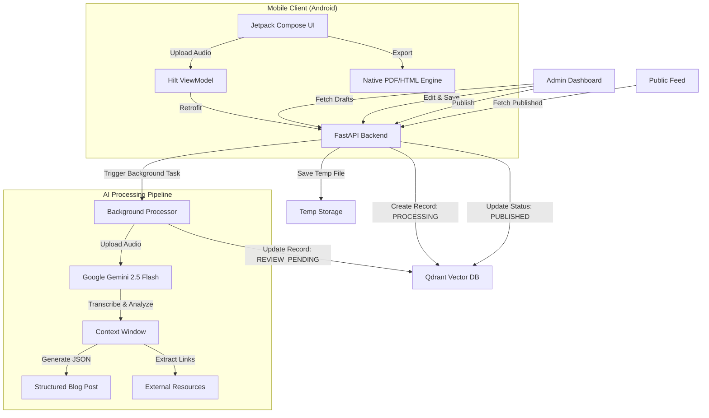

# 🎙️ AuraArchive

AuraArchive is an intelligent audio-to-blog platform that transforms raw audio discussions into high-quality, structured, and publishable tech articles.

Video Demo - [Click Here](https://youtube.com/shorts/dO3vPy0-mNw?feature=share)

**Made with ❤️ by Nirvan and Dhairya**

---

## 🏗️ Architecture

AuraArchive utilizes a modern, event-driven architecture that follows a **Cloud-Native, Mobile-First** approach. It separates heavy AI processing on the backend from seamless content management and consumption on the Android client.

### 🔄 System Data Flow



## ⚙️ App Specifications & Tech Stack

### 📱 Mobile App (Android)

*   **Language:** Kotlin
*   **UI Framework:** Jetpack Compose with Material 3
*   **Architecture:** MVVM (Model-View-ViewModel)
*   **Dependency Injection:** Dagger Hilt
*   **Networking:** Retrofit + OkHttp
*   **Image Loading:** Coil
*   **Export Engine:** Native Android PdfDocument and a custom HTML-to-Doc Intent system for seamless Google Docs integration

### 🖥️ Backend Core

*   **Framework:** FastAPI (Python) - High performance, async-first
*   **Database:** Qdrant (Cloud) - Vector database used for scalable document storage and (future) semantic search
*   **AI Model:** Google Gemini 2.5 Flash - Multimodal model for processing audio and generating structured JSON output

## 🚀 Key Features

*   **Audio-to-Blog:** Direct upload of MP3/WAV files from mobile to the AI processing pipeline.
*   **Structured AI Output:** Gemini 2.5 Flash ensures valid JSON with dedicated fields for title, summary, content, and external_links.
*   **Seamless Export:** One-tap export of generated blogs directly to Google Docs for final editing or PDF for standard sharing.
*   **Modern Mobile Experience:** Custom-themed interface featuring time-based greetings and a daily "Inspiration Engine" powered by the Quotable API.
*   **Review System:** AI-generated drafts enter a **REVIEW_PENDING** state, allowing for administrative oversight before going public.

## 🔌 API Documentation

### 1. Upload & Processing

*   **Endpoint:** `POST /api/upload`
*   **Input:** `file` (Audio file)
*   **Action:** Uploads file and initiates background AI reasoning task
*   **Response:** `{ "id": "uuid", "message": "Upload accepted" }`

### 2. Draft Management (Admin)

*   **Endpoint:** `GET /api/drafts`
    *   **Returns:** List of discussions with status **REVIEW_PENDING**

*   **Endpoint:** `PUT /api/save/{id}`
    *   **Input:** JSON `{ "title": "...", "summary": "...", "blog_markdown": "..." }`
    *   **Action:** Updates the content of a draft.

*   **Endpoint:** `POST /api/publish/{id}`
    *   **Action:** Changes status to **PUBLISHED**

### 3. Public Access

*   **Endpoint:** `GET /api/feed`
    *   **Returns:** List of discussions with status **PUBLISHED**

## 🚀 Setup & Installation

### Android (Mobile)

1.  Clone the repository.
2.  Open in Android Studio (Ladybug or newer).
3.  Ensure proper Base URLs are configured in your `Hilt AppModule.kt`.

### Backend (Python)

**Prerequisites:** Python 3.10+, Qdrant Cloud Cluster, Google AI Studio API Key.

**Environment Variables (.env):**

Create a `.env` file in the root directory:

```env
GEMINI_API_KEY=your_gemini_key
QDRANT_URL=your_qdrant_url
QDRANT_API_KEY=your_qdrant_key
CLOUDINARY_CLOUD_NAME=your_cloudinary_name
CLOUDINARY_API_KEY=your_cloudinary_key
CLOUDINARY_API_SECRET=your_cloudinary_secret
```

**Running the Server:**

```bash
# Install dependencies
pip install -r requirements.txt

# Start the server (Dev Mode)
python -m uvicorn backend.main:app --reload
```
