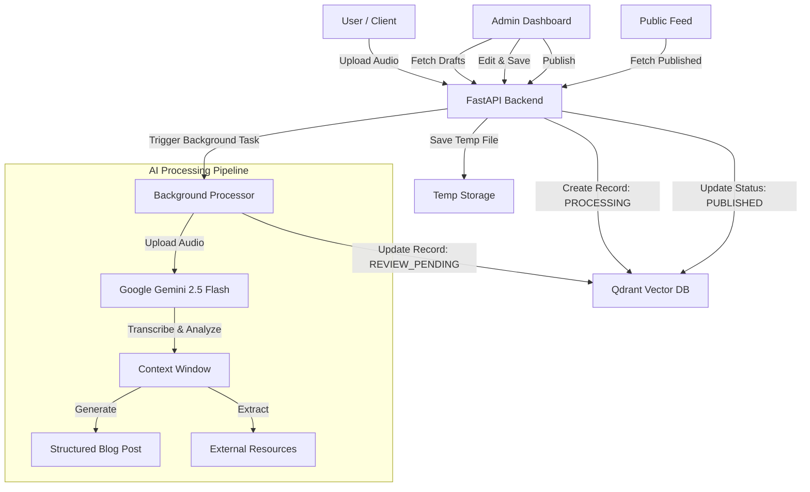

# 🎙️ AuraArchive

AuraArchive is an intelligent audio-to-blog platform that transforms raw audio discussions into high-quality, structured, and publishable tech articles.

**Made with ❤️ by Nirvan and Dhairya**

---

## 🏗️ Architecture

The system uses a modern, event-driven architecture powered by **FastAPI** for the backend and **Google Gemini 2.5 Flash** for high-speed automated reasoning and content generation.

### 🔄 Data Flow



---

## ⚙️ App Specifications & Tech Stack

### Backend Core
- **Framework:** FastAPI (Python) - High performance, async-first.
- **Database:** Qdrant (Cloud) - Vector database used for scalable document storage and (future) semantic search.
- **AI Model:** Google Gemini 2.5 Flash - Multimodal model for processing audio and generating structured JSON output.

### Key Features
1.  **Audio-to-Blog:** Upload an MP3/WAV, get a full markdown article.
2.  **Structured Output:** AI guarantees valid JSON with separate fields for `title`, `summary`, `content`, and `external_links`.
3.  **Review System:** Drafts go to a "Review" state before being published.
4.  **Resilient Parsing:** Robust extraction logic handles AI formatting inconsistencies (markdown blocks, nested JSON).

---

## 🔌 API Documentation

### 1. Upload & Processing
**endpoint:** `POST /api/upload`
- **Input:** `file` (Audio file)
- **Process:** Uploads file, starts background AI task.
- **Response:** `{ "id": "uuid", "message": "Upload accepted" }`

### 2. Draft Management (Admin)
**endpoint:** `GET /api/drafts`
- **Returns:** List of discussions with status `REVIEW_PENDING`.

**endpoint:** `PUT /api/save/{id}`
- **Input:** JSON `{ "title": "...", "summary": "...", "blog_markdown": "..." }`
- **Action:** Updates the content of a draft.

**endpoint:** `POST /api/publish/{id}`
- **Action:** Changes status to `PUBLISHED`.

### 3. Public Access
**endpoint:** `GET /api/feed`
- **Returns:** List of discussions with status `PUBLISHED`.

---

## 🚀 Setup & Installation

### Prerequisites
- Python 3.10+
- Qdrant Cloud Cluster
- Google AI Studio API Key

### Environment Variables (.env)
Create a `.env` file in the root directory:
```env
GEMINI_API_KEY=your_gemini_key
QDRANT_URL=your_qdrant_url
QDRANT_API_KEY=your_qdrant_key
CLOUDINARY_CLOUD_NAME=...
CLOUDINARY_API_KEY=...
CLOUDINARY_API_SECRET=...
```

### Running the Server
```bash
# Install dependencies
pip install -r requirements.txt

# Start the server (Dev Mode)
python -m uvicorn backend.main:app --reload
```

---

*Verified and maintained by the engineering team.*
